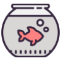

# 達成したタスク

## 目的

達成したタスクを振り返れるように登録できるようにする。 
また、登録した達成したタスクの振り返りがしやすいように複数の入力項目を設けている。

## 入力項目

|  項目名  | 内容  | 入力必須 |
| ---- | ---- | ---- |
|  日付  | 達成したタスクが発生した日 | ◯ |
|  本文  | 達成したタスクの内容のテキスト | ◯ |
|  カテゴリー  | 達成したタスクのカテゴリーを設定 詳細は、こちらを参照 | ◯ |
|  Good  | 達成したタスクが良い出来事だった | ✕ |
|  Bad  | 達成したタスクが悪い出来事だった | ✕ |

## カテゴリー

以下のカテゴリーが存在する。

|  項目名  | 画像 |
| ---- | ---- |
|  生活全般  |  |
|  飲食した  |  |
|  健康関連  |  |
|  外出した  |  |
|  趣味全般  |  |
|  鑑賞した  |  |
|  勉強した  |  |
|  買った  |  |
|  特別なこと  |  |